<div align="center">

# ⚡ WaldonCFscanner | Cloudflare Clean IP & Xray Verifier

[](https://github.com/amirrezas/WaldonCFscanner/actions)
[](https://github.com/amirrezas/WaldonCFscanner/releases)
[](https://github.com/amirrezas/WaldonCFscanner/releases)
[](https://opensource.org/licenses/MIT)

*An incredibly fast, highly-optimized Cloudflare Clean IP Scanner engineered specifically to bypass severe internet censorship infrastructures (such as the Great Firewall) using modern proxy protocols.*

**[برای مطالعه نسخه فارسی اینجا کلیک کنید (Persian Version)](README_fa.md)**

</div>

Created by [@amirrezas](https://github.com/amirrezas). Inspired by the works of MortezaBashsiz and the global anti-censorship community.

---


## 🚀 Quick Start: Installation & Usage (Zero-Setup Execution)

The engine features an autonomous bootstrap sequence, meaning you do not need to install packages, deal with Go binaries, or understand command lines to run this.

### 🪟 Windows (Easiest Method - Standalone `.exe`)
You do not need to install Python at all!
1. Go to the **[Releases](../../releases/latest)** section on the right side of this GitHub page.
2. Download `WaldonCFscanner.exe`.
3. Place it in an empty folder and double-click it. 
   *(Note: The `ipv4.txt` and domain lists are permanently embedded inside the executable! However, if you want to use your own custom `ipv4.txt` or `config.json`, simply place them next to the `.exe` and the program will automatically prioritize yours).*

### 📱 Android (Native APK - Portable Engine)
No PC or Python required. The Android version features the full 4-stage pipeline in a mobile interface.
1. Download `WaldonCFscanner_v1.1.apk` from the **[Latest Release](../../releases/latest)**.
2. Install the APK (allow "Install from Unknown Sources" if prompted).
3. Paste your VLESS or Trojan link and hit **Initialize Engine**.

### 📟 Termux (Android Terminal)
If you prefer running the raw Python script on Android:
1. **Install Dependencies:**
   ```bash
   apt update && apt install python wget -y
   ```
2. **Download the Engine:**
   ```bash
   mkdir WaldonCFscanner && cd WaldonCFscanner
   H="https://"
   D="raw.githubusercontent"
   E=".com/amirrezas/WaldonCFscanner/master"
   REPO="${H}${D}${E}"
   wget "$REPO/scanner.py"
   wget "$REPO/ipv4.txt"
   wget "$REPO/ipv6.txt"
   wget "$REPO/cloudflare-domains.txt"
   ```
3. **Run the Scanner:**
   ```bash
   python scanner.py
   ```

### 🐧 Linux (Ubuntu / Debian)
1. **Install Python:**
   ```bash
   apt update && apt install python python-pip wget -y
   ```
2. **Download the Engine:**
   ```bash
   mkdir WaldonCFscanner && cd WaldonCFscanner
   H="https://"
   D="raw.githubusercontent"
   E=".com/amirrezas/WaldonCFscanner/master"
   REPO="${H}${D}${E}"
   wget "$REPO/scanner.py"
   wget "$REPO/ipv4.txt"
   wget "$REPO/ipv6.txt"
   wget "$REPO/cloudflare-domains.txt"
   ```
3. **Run the Scanner:**
   ```bash
   python scanner.py
   ```

### 🍏 macOS
1. **Install Python & Wget:** Run `brew install python wget` (requires Homebrew).
2. **Download and Run:**
   ```bash
   mkdir WaldonCFscanner && cd WaldonCFscanner
   H="https://"
   D="raw.githubusercontent"
   E=".com/amirrezas/WaldonCFscanner/master"
   REPO="${H}${D}${E}"
   wget "$REPO/scanner.py"
   wget "$REPO/ipv4.txt"
   wget "$REPO/ipv6.txt"
   wget "$REPO/cloudflare-domains.txt"
   python scanner.py
   ```

---

## ⚙️ How to use the Auto-Config Generator
You can personalize the scanner to automatically generate ready-to-use VPN profiles based on your private server parameters.

* **Via JSON:** Place your server's base config inside a file named `config.json` in the root folder before running.
* **Via URI (Clipboard):** While the program is running, click the **"📋 Paste"** button in the Terminal Dashboard to instantly pull your `vless://...` or `trojan://...` link directly from your clipboard!

When the scanner discovers a top-tier clean IP, it will create an `output_configs/` directory containing customized `.json` client files and a text file packed with shareable, high-speed URIs.

---

## 🌍 The Ethical Standpoint: Internet as a Human Right

Access to information, freedom of expression, and digital privacy are fundamental human rights. This tool exists because no entity should have the power to artificially isolate its citizens from the global community. **WaldonCFscanner** empowers individuals to bypass oppressive firewalls, resist Deep Packet Inspection (DPI), and reclaim their right to the open web.

---

## 🏗️ System Architecture: Why This Scanner Stands Out

### The Core Problem: Deep Packet Inspection (DPI)
Traditional Cloudflare scanners rely on simple ICMP pings or basic TCP handshakes. While those methods verify that an edge node is physically reachable, they completely fail to account for modern censorship mechanisms. Advanced firewalls deploy Deep Packet Inspection (DPI). A node might return a 20ms ping, but the firewall will instantly sever the TCP connection the moment it detects unauthorized SNIs, anomalous byte distributions, or legacy VPN signatures.

### The VLESS over TLS Solution
**WaldonCFscanner** resolves this by verifying the *actual proxy tunnel protocol* through a cryptographically secure channel. By utilizing the VLESS protocol inside a TLS wrapper, the DPI filter cannot distinguish the proxy traffic from a standard user visiting a secure HTTPS website.

```text
+-------------------+       +--------------------+       +-------------------+       +-------------------+
|                   |       |                    |       |                   |       |                   |
|   User Machine    |       |   Great Firewall   |       |  Cloudflare Edge  |       |    Uncensored     |
|   (Scanner Core)  | =====>|    (DPI Filter)    | =====>|  (Reverse Proxy)  | =====>|     Internet      |
|  [VLESS Client]   |  TLS  | Passes Inspection  | VLESS |  [VLESS Server]   | HTTP  |                   |
|                   |       |                    |       |                   |       |                   |
+-------------------+       +--------------------+       +-------------------+       +-------------------+
```

---

## ⚙️ Deep Dive: The 4-Stage Verification Engine

To find 10 flawless, high-speed IPs out of billions of potential IPv4 and IPv6 combinations without exhausting local system memory or crashing the host router, the scanner acts as an aggressive, asynchronous, hardware-aware assembly line. 

```mermaid
graph TD
    classDef gen fill:#333,stroke:#555,stroke-width:2px,color:#fff;
    classDef pass fill:#156064,stroke:#3b82f6,stroke-width:2px,color:#fff;
    classDef drop fill:#501a1a,stroke:#ef4444,stroke-width:2px,color:#fff;
    classDef final fill:#166534,stroke:#10b981,stroke-width:3px,color:#fff;

    A[Subnet IP Generator<br>Millions of IPs]:::gen -->|Phase 1| B(TCP Probe<br>Port 443):::pass
    B -->|Timeout/Fail| X1[Drop]:::drop
    B -->|Port 443 Open| C(TLS & SNI Injection<br>Handshake):::pass
    C -->|SNI Mismatch| X2[Drop]:::drop
    C -->|Valid Handshake| D(Speed Test<br>Throughput Check):::pass
    D -->|Too Slow| X3[Drop]:::drop
    D -->|> Threshold| E{Xray Core Routing<br>True Payload Verification}:::pass
    E -->|Fake 204 / HTTP Error| X4[Drop]:::drop
    E -->|Successful Routing| F((✅ Verified Clean IPs)):::final
```



### Stage 1: Asynchronous TCP Probing (Layer 4)
* **Objective:** Rapidly eliminate "dead" IP addresses that do not respond on port 443.
* **Mechanism:** Python's `asyncio.open_connection` fires off hundreds of concurrent socket requests. The worker instantly closes the socket the millisecond the `SYN-ACK` packet is received.

### Stage 2: TLS SNI Injection (Layer 7)
* **Objective:** Cryptographically verify the node belongs to Cloudflare and bypass SNI-based domain blocking.
* **Mechanism:** The engine crafts an unverified `ssl.create_default_context()` and establishes a secure tunnel, injecting a "clean" domain into the SNI header. If the response headers contain Cloudflare signatures, the IP is verified as a valid proxy entry point.

### Stage 3: Pure Python Speed Test (Throughput Benchmarking)
* **Objective:** Filter out IPs that are heavily throttled or suffer from severe packet loss.
* **Mechanism:** A passing IP is subjected to a raw HTTP download of a 1MB payload from `speed.cloudflare.com/__down`. The engine calculates the precise Time-Delta. IPs that fail to sustain a high Mbps threshold are discarded immediately.

### Stage 4: Headless Xray-Core Verification
* **Objective:** The ultimate proof of concept. Verify that the IP can successfully route VLESS websocket traffic.
* **Mechanism:** The engine dynamically strips unnecessary parameters (like `routing` or `dns` blocks) to prevent `geosite.dat` crash loops. It binds an isolated, headless instance of the official `Xray-core` binary to a randomized local port (between 20000 and 50000) and routes a live proxy connection to `cp.cloudflare.com` to calculate the cryptographically-verified Time-to-First-Byte (TTFB).

---

## 🧠 Algorithmic Optimizations Under the Hood

* **Hardware-Aware Concurrency limits:** The engine reads `os.cpu_count()` to calculate safe socket ceilings (capping at 1000 on Windows due to OS kernel limitations, but unlocking up to 3000 on Linux/macOS utilizing `epoll`).
* **Stratified Subnet Randomization:** The algorithm maps the imported IP lists and groups networks by their first octet, ensuring a truly global distribution of tested datacenters.
* **The "Hot-Subnet" Feedback Loop:** When a Stage 2 TLS handshake succeeds, the engine caches that `/24` subnet and temporarily focuses resources there, effectively "mining" successful datacenters for more working nodes.
* **Asynchronous Backpressure Mitigation:** Bounded `asyncio.Queue(maxsize=X)` prevents the program from consuming gigabytes of RAM by dropping excess IPs if the heavier Xray queues become too full.
* **Bi-Directional Configuration Parsing:** A robust RegEx engine capable of translating back and forth between standard nested Xray JSON files and URL URI strings (e.g., `vless://`) in real-time.

---

## 🛠️ Troubleshooting & Contribution

If you encounter issues, please utilize the built-in diagnostic tools before opening a GitHub Issue.

1. **The Professional Logger:** Click the **"Save Log"** button in the TUI. The Python `logging` module runs silently in the background, capturing standard outputs, socket timeouts, JSON parsing errors, and raw Subprocess Tracebacks.
2. **Review `scanner_error.log`:** Check this file in your root directory. It will explicitly tell you if `xray.exe` is missing, if a port failed to bind, or if an issue occurred during rendering.
3. **Open an Issue:** Navigate to the [GitHub Issues tab](https://github.com/amirrezas/WaldonCFscanner/issues) and attach your `scanner_error.log` file. Community contributions, pull requests, and bug reports are highly encouraged!

---

*Disclaimer: This software is provided as an open-source tool for network diagnostics, latency optimization, and ensuring open access to the free internet. The developers are not responsible for the misuse of this tool. Please adhere to your local networking guidelines responsibly.*