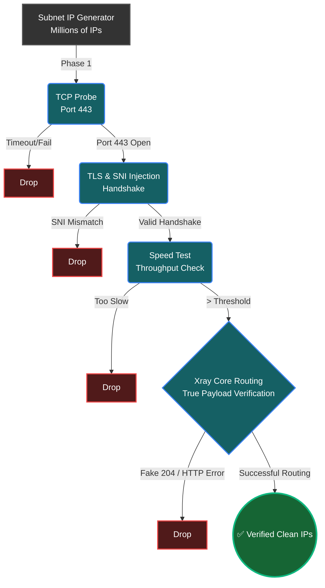

<div dir="rtl" align="center">

# ⚡ WaldonCFscanner | ابزار پیشرفته بررسی VLESS با هسته Xray

[](https://github.com/amirrezas/WaldonCFscanner/actions)
[](https://github.com/amirrezas/WaldonCFscanner/releases)
[](https://github.com/amirrezas/WaldonCFscanner/releases)
[](https://opensource.org/licenses/MIT)

*یک اسکنر آی‌پی کلودفلر فوق‌العاده سریع و بهینه‌سازی شده، که منحصراً برای دور زدن فایروال‌های پیشرفته با تست واقعی ترافیک مهندسی شده است.*

**[🇺🇸 برای مطالعه نسخه انگلیسی اینجا کلیک کنید (English Version)](README.md)**

</div>

<div dir="rtl" align="right">

ساخته شده توسط [@amirrezas](https://github.com/amirrezas). با الهام از کارهای `MortezaBashsiz` و جامعه جهانی ضد سانسور.

---

## 🚀 شروع سریع: نصب و استفاده (اجرای بدون نیاز به تنظیمات)

ما معتقدیم ابزارهای ضد سانسور باید برای همه قابل دسترس باشند. موتور این برنامه دارای یک سیستم راه‌اندازی (`Bootstrap`) کاملاً خودکار است، به این معنی که نیازی به نصب پکیج‌ها، فایل‌های باینری، یا درک خط فرمان ندارید.

### 🪟 نصب در ویندوز (آسان‌ترین روش - نسخه `.exe`)
شما نیازی به نصب پایتون ندارید!
۱. به بخش **[Releases](../../releases/latest)** در سمت راست همین صفحه گیت‌هاب بروید.

۲. فایل `WaldonCFscanner.exe` را دانلود کنید.

۳. فایل را در یک پوشه خالی قرار داده و روی آن دابل‌کلیک کنید. 

*(نکته: فایل‌های `ipv4.txt` و لیست دامنه‌ها به طور دائم درون فایل اجرایی تعبیه شده‌اند! با این حال، اگر می‌خواهید از فایل‌های `ipv4.txt` یا `config.json` شخصی خود استفاده کنید، فقط کافیست آن‌ها را در کنار فایل `.exe` قرار دهید تا برنامه به طور خودکار فایل‌های شما را اولویت قرار دهد).*

### 📱 اندروید (نسخه APK - موتور همراه)
بدون نیاز به کامپیوتر یا پایتون. نسخه اندروید تمامی مراحل اسکن را در یک محیط گرافیکی موبایل انجام می‌دهد.
۱. فایل `WaldonCFscanner_v1.1.apk` را از بخش **[Latest Release](../../releases/latest)** دانلود کنید.

۲. فایل را نصب کنید (در صورت نیاز، اجازه نصب از منابع ناشناس یا Unknown Sources را بدهید).

۳. لینک VLESS خود را پیست کرده و دکمه **Initialize Engine** را بزنید.


### 📟 ترموکس / Termux (ترمینال اندروید)
اگر ترجیح می‌دهید اسکریپت خام پایتون را روی اندروید اجرا کنید:

۱. **نصب پیش‌نیازها:**
</div>
<div dir="ltr" align="left">

   ```bash
   apt update && apt install python wget -y
   ```
</div>
<div dir="rtl" align="right">

۲. **دانلود موتور اسکنر:**
</div>
<div dir="ltr" align="left">

   ```bash
   mkdir WaldonCFscanner && cd WaldonCFscanner
   H="https://"
   D="raw.githubusercontent"
   E=".com/amirrezas/WaldonCFscanner/master"
   REPO="${H}${D}${E}"
   wget "$REPO/scanner.py"
   wget "$REPO/ipv4.txt"
   wget "$REPO/ipv6.txt"
   wget "$REPO/cloudflare-domains.txt"
   ```
</div>
<div dir="rtl" align="right">

۳. **اجرای اسکنر:**
</div>
<div dir="ltr" align="left">

   ```bash
   python scanner.py
   ```
</div>
<div dir="rtl" align="right">


### 🐧 لینوکس (`Ubuntu` / `Debian`)

۱. **نصب پایتون:**
</div>
<div dir="ltr" align="left">

   ```bash
   sudo apt update && sudo apt install python python-pip wget -y
   ```
</div>
<div dir="rtl" align="right">

۲. **دانلود موتور اسکنر:**
</div>
<div dir="ltr" align="left">

   ```bash
   mkdir WaldonCFscanner && cd WaldonCFscanner
   H="https://"
   D="raw.githubusercontent"
   E=".com/amirrezas/WaldonCFscanner/master"
   REPO="${H}${D}${E}"
   wget "$REPO/scanner.py"
   wget "$REPO/ipv4.txt"
   wget "$REPO/ipv6.txt"
   wget "$REPO/cloudflare-domains.txt"
   ```
</div>
<div dir="rtl" align="right">

۳. **اجرای اسکنر:**
</div>
<div dir="ltr" align="left">

   ```bash
   python scanner.py
   ```
</div>
<div dir="rtl" align="right">


### 🍏 مک‌اواس (`macOS`)

۱. **نصب پایتون:** دستور `brew install python wget` را اجرا کنید.


۲. **دانلود و اجرا:**
</div>
<div dir="ltr" align="left">

   ```bash
   mkdir WaldonCFscanner && cd WaldonCFscanner
   H="https://"
   D="raw.githubusercontent"
   E=".com/amirrezas/WaldonCFscanner/master"
   REPO="${H}${D}${E}"
   wget "$REPO/scanner.py"
   wget "$REPO/ipv4.txt"
   wget "$REPO/ipv6.txt"
   wget "$REPO/cloudflare-domains.txt"
   python scanner.py
   ```
</div>
<div dir="rtl" align="right">

---

## ⚙️ نحوه استفاده از تولیدکننده خودکار کانفیگ
شما می‌توانید اسکنر را شخصی‌سازی کنید تا به طور خودکار پروفایل‌های `VPN` آماده‌ی استفاده را بر اساس سرور شخصی شما تولید کند.

* **از طریق `JSON`:** قبل از اجرای برنامه، کانفیگ پایه `VLESS` سرور خود را در فایلی به نام `config.json` در پوشه اصلی برنامه قرار دهید.
* **از طریق `URI` (کلیپ‌بورد):** در حالی که برنامه در حال اجراست، روی دکمه **"📋 Paste"** در داشبورد ترمینال کلیک کنید تا لینک کپی شده‌ی شما (مثلاً `...//:vless`) مستقیماً از کلیپ‌بورد دریافت و اعمال شود!

هنگامی که اسکنر یک آی‌پی عالی پیدا کند، پوشه‌ای به نام `output_configs` ایجاد کرده و فایل‌های آماده `.json` و یک فایل `vless_links.txt` حاوی لینک‌های پرسرعت و قابل اشتراک‌گذاری را در آن ذخیره می‌کند.

---

## 🌍 دیدگاه اخلاقی: اینترنت به عنوان یک حقوق بشر

در سال ۲۰۱۶، شورای حقوق بشر سازمان ملل متحد قطعنامه‌ای تاریخی را تصویب کرد که در آن قطع اینترنت را صراحتاً محکوم کرده و تأکید می‌کند که *"حقوقی که افراد در دنیای آفلاین دارند، باید در فضای آنلاین نیز محافظت شود."* دسترسی به اطلاعات، آزادی بیان و حریم خصوصی دیجیتال، از حقوق بنیادین بشر هستند.

این ابزار ساخته شده است زیرا هیچ دولت یا نهادی نباید این قدرت را داشته باشد که شهروندان خود را به طور مصنوعی از جامعه جهانی جدا کند. ابزار `WaldonCFscanner` به افراد این قدرت را می‌دهد تا فایروال‌های سرکوبگر را دور بزنند، در برابر سیستم‌های بازرسی عمیق بسته‌ها (`DPI`) مقاومت کنند و حق مسلم خود را برای دسترسی به وب آزاد پس بگیرند.

---

## 🏗️ معماری سیستم: چرا این اسکنر متمایز است؟

### مشکل اساسی: بازرسی عمیق بسته‌ها (`DPI`)
اسکنرهای سنتی کلودفلر بر پینگ‌های ساده `ICMP` یا هندشیک‌های پایه `TCP` تکیه می‌کنند. در حالی که این روش‌ها صرفاً در دسترس بودن فیزیکی یک نود (`Node`) را تأیید می‌کنند، مکانیسم‌های مدرن سانسور را کاملاً نادیده می‌گیرند. فایروال‌های پیشرفته از بازرسی عمیق بسته‌ها (`DPI`) استفاده می‌کنند. یک آی‌پی ممکن است پینگ ۲۰ میلی‌ثانیه بدهد، اما فایروال به محض تشخیص `SNI`های غیرمجاز، توزیع غیرعادی بایت‌ها، یا امضاهای `VPN`های قدیمی، فوراً اتصال را قطع می‌کند.

### راهکار `VLESS` بر بستر `TLS`
ابزار `WaldonCFscanner` این مشکل را با تأیید *پروتکل واقعی تونل پروکسی* از طریق یک کانال امن رمزنگاری‌شده حل می‌کند. با قرار دادن پروتکل `VLESS` در داخل یک پوشش `TLS`، فیلتر `DPI` نمی‌تواند ترافیک پروکسی را از ترافیک یک کاربر معمولی که در حال بازدید از یک وب‌سایت امن `HTTPS` است تشخیص دهد.

</div>
<div dir="ltr" align="left">

```text
+-------------------+       +--------------------+       +-------------------+       +-------------------+
|                   |       |                    |       |                   |       |                   |
|   User Machine    |       |   Great Firewall   |       |  Cloudflare Edge  |       |    Uncensored     |
|   (Scanner Core)  | =====>|    (DPI Filter)    | =====>|  (Reverse Proxy)  | =====>|     Internet      |
|  [VLESS Client]   |  TLS  | Passes Inspection  | VLESS |  [VLESS Server]   | HTTP  |                   |
|                   |       |                    |       |                   |       |                   |
+-------------------+       +--------------------+       +-------------------+       +-------------------+
```

</div>
<div dir="rtl" align="right">

---

## ⚙️ بررسی عمیق: موتور تأیید ۴-مرحله‌ای

برای یافتن ۱۰ آی‌پی بی‌نقص و پرسرعت از میان میلیاردها ترکیب احتمالی `IPv4` و `IPv6` بدون پر کردن حافظه رم سیستم یا از کار انداختن روتر میزبان، این اسکنر به عنوان یک خط تولید تهاجمی، ناهمگام (`Asynchronous`) و آگاه به سخت‌افزار عمل می‌کند.

</div>
<div dir="ltr" align="left">



</div>
<div dir="rtl" align="right">

### مرحله ۱: کاوش ناهمگام شبکه (`TCP`)
* **هدف:** حذف سریع آدرس‌های `IP` مرده که در پورت ۴۴۳ پاسخی نمی‌دهند.
* **مکانیسم:** از تابع `asyncio.open_connection` پایتون برای ارسال صدها درخواست سوکت همزمان استفاده می‌شود. برنامه (`Worker`) دقیقاً در همان میلی‌ثانیه‌ای که بسته `SYN-ACK` دریافت می‌شود، سوکت را می‌بندد.

### مرحله ۲: تزریق `TLS SNI`
* **هدف:** تأیید رمزنگاری‌شده‌ی تعلق آی‌پی به کلودفلر و دور زدن مسدودسازی دامنه‌ها مبتنی بر `SNI`.
* **مکانیسم:** موتور یک نشست `ssl` تأیید نشده می‌سازد و یک تونل امن برقرار می‌کند، و یک دامنه "سفید" را به هدر `SNI` تزریق می‌کند. اگر هدرهای پاسخ حاوی امضاهای کلودفلر باشد، `IP` به عنوان یک نقطه ورود معتبر تأیید می‌شود.

### مرحله ۳: تست سرعت خالص پایتون (`Throughput`)
* **هدف:** فیلتر کردن `IP`هایی که به شدت محدود شده‌اند (`Throttled`) یا دچار از دست رفتن شدید بسته‌ها (`Packet Loss`) هستند.
* **مکانیسم:** یک `IP` پذیرفته‌شده، تحت دانلود خام `HTTP` یک فایل ۱ مگابایتی از سرور تست کلودفلر قرار می‌گیرد. آی‌پی‌هایی که نتوانند سرعت مگابیت بر ثانیه بالایی را حفظ کنند بلافاصله کنار گذاشته می‌شوند.

### مرحله ۴: تأیید نهایی توسط هسته `Xray` بدون رابط گرافیکی 
* **هدف:** اثبات نهایی مفهوم. تأیید اینکه `IP` می‌تواند ترافیک وب‌سوکت `VLESS` را با موفقیت مسیریابی کند.
* **مکانیسم:** موتور به صورت پویا پارامترهای غیرضروری را حذف می‌کند تا از کرش کردن فایل `geosite.dat` جلوگیری کند. سپس یک نمونه ایزوله از `Xray-core` را در پس‌زمینه اجرا کرده و یک اتصال زنده را از طریق سرور تست هدایت می‌کند تا پینگ دقیق و رمزنگاری‌شده (`TTFB`) را محاسبه کند.

---

## 🧠 بهینه‌سازی‌های الگوریتمی در پس‌زمینه

* **محدودیت‌های همزمانی هوشمند:** موتور برنامه با خواندن `os.cpu_count` سقف ایمن سوکت‌ها را محاسبه می‌کند (محدودیت ۱۰۰۰ سوکت در ویندوز، اما تا ۳۰۰۰ سوکت در لینوکس و مک‌اواس با استفاده از مکانیزم `epoll`).
* **تصادفی‌سازی طبقه‌بندی‌شده:** الگوریتم شبکه‌ها را بر اساس اکتت اول دسته‌بندی می‌کند تا از یک توزیع کاملاً جهانی اطمینان حاصل کند.
* **حلقه بازخورد ساب‌نت‌های داغ:** هنگامی که یک آی‌پی موفق می‌شود، برنامه آن بلوک را به خاطر می‌سپارد و موقتاً تمرکز را روی آن منطقه افزایش می‌دهد.
* **کاهش فشار ناهمگام:** صف‌های `asyncio.Queue` محدود شده از مصرف بیش از حد رم جلوگیری می‌کنند و در صورت شلوغی بیش از حد، آی‌پی‌های اضافی را دور می‌اندازند.
* **تجزیه دوطرفه پیکربندی:** موتور قدرتمند `RegEx` که فایل‌های تو در توی `JSON` و لینک‌های متنی را در لحظه به یکدیگر تبدیل می‌کند.

---

## 🛠️ عیب‌یابی و مشارکت

اگر با مشکلی مواجه شدید، لطفاً قبل از باز کردن یک درخواست (`Issue`) در گیت‌هاب، از ابزارهای تشخیصی داخلی استفاده کنید:

۱. **لاگر حرفه‌ای:** روی دکمه **"Save Log"** در داشبورد ترمینال (`TUI`) کلیک کنید. ماژول `logging` پایتون به طور خاموش در پس‌زمینه اجرا می‌شود و خروجی‌ها، تایم‌اوت‌های سوکت، و خطاهای هسته `Xray` را ثبت می‌کند.

۲. **بررسی لاگ:** فایل `scanner_error.log` را در پوشه اصلی برنامه بررسی کنید.

۳. **گزارش مشکل:** به برگه `GitHub Issues` بروید و فایل لاگ خود را پیوست کنید. مشارکت‌های برنامه‌نویسان دیگر به شدت استقبال می‌شود!

---

*سلب مسئولیت: این نرم‌افزار به عنوان یک ابزار متن‌باز برای عیب‌یابی شبکه، بهینه‌سازی تأخیر و تضمین دسترسی آزاد به اینترنت ارائه شده است. توسعه‌دهندگان هیچ مسئولیتی در قبال سوءاستفاده از این ابزار ندارند. لطفاً مسئولانه از آن استفاده کنید.*

</div>